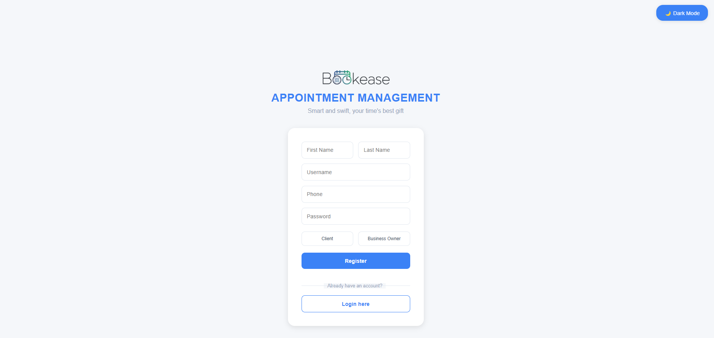
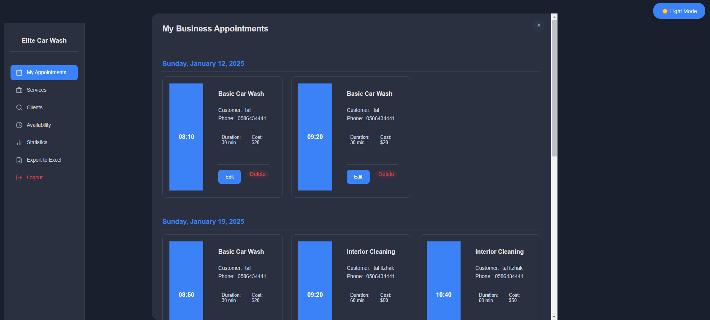
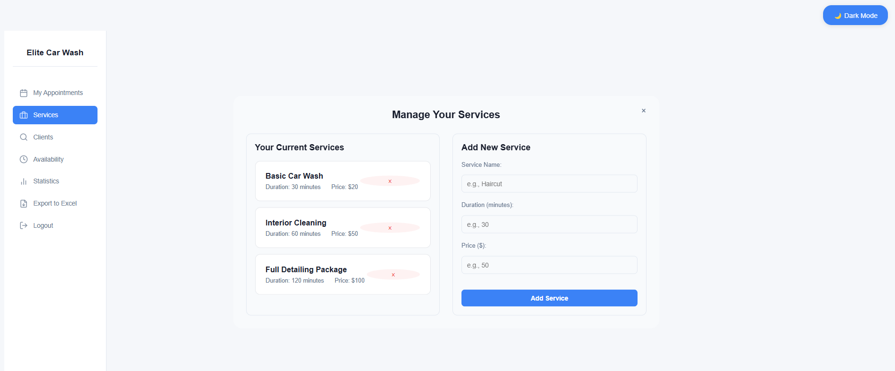
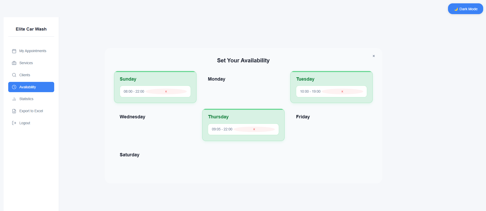
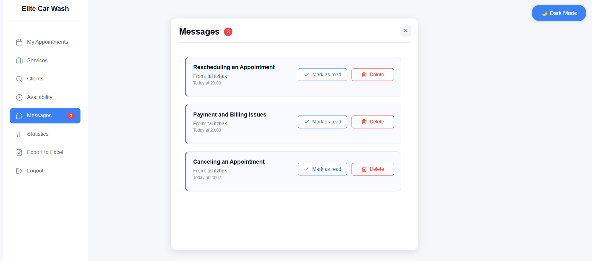
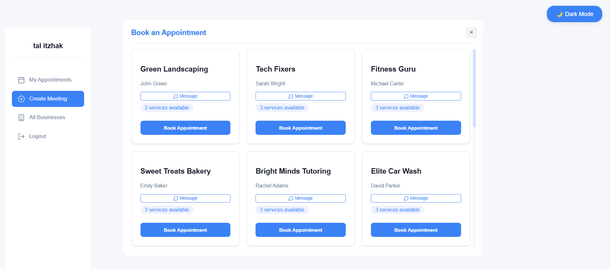
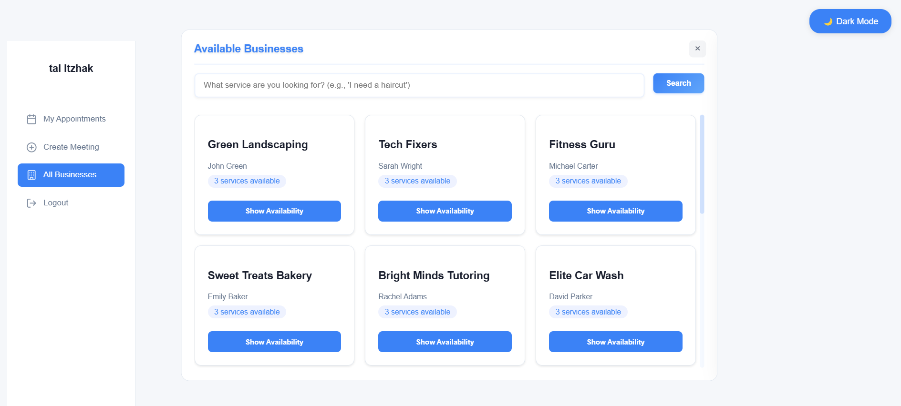

# 🗓️ Appointment Management System


A full-stack appointment scheduling application built with FastAPI and React, featuring a dark/light theme and role-based access control.

## 🖼️ Screenshots

## Login 


## Business Management






## Customer Features




## ✨ Features

### For Business Owners
- 📅 Manage service availability by day and time
- 💼 Create and manage services with pricing
- 📊 View daily statistics and revenue
- 📋 Export appointments to Excel
- 🔍 Search client appointments by phone number
- 📩 Receive and manage messages from customers


### For Customers
- 👥 Browse available businesses
- 📅 Book appointments
- ⏰ View business availability
- 📋 Track appointment history
- ✉️ Send messages to business owners

### General Features
- 🧠 Natural language business search
- 🎯 Intelligent service matching
- 🌓 Dark/Light theme toggle
- 🔐 JWT authentication
- 👥 Role-based access control
- 📱 Responsive design
- ⚡ Real-time validation

  

## 🚀 Getting Started

### Prerequisites

1.Hugging Face API Key:

Create an account at Hugging Face
Generate an API key from your account settings
Create a .env file in the llm_service directory and add your API key:

   ```yaml
HUGGINGFACE_API_KEY=your_api_key_here


### Docker Setup (Recommended)
2. Create a `docker-compose.yml` file in the root directory:

   ```yaml
   version: '3.8'

   services:
     backend:
       build: ./backend
       ports:
         - "8000:8000"
       volumes:
         - ./backend:/app
       command: uvicorn app.main:app --host 0.0.0.0 --port 8000 --reload
       depends_on:
         - db
         - llm_service

     frontend:
       build: ./frontend
       ports:
         - "3000:3000"
       volumes:
         - ./frontend:/app
         - /app/node_modules
       environment:
         - REACT_APP_API_URL=http://localhost:8000
       depends_on:
         - backend

     llm_service:
       build: ./llm_service
       ports:
         - "8001:8001"
       volumes:
         - ./llm_service:/app
       environment:
         - HUGGINGFACE_API_KEY=${HUGGINGFACE_API_KEY}

     db:
       image: mysql:8.0
       environment:
    - MYSQL_DATABASE=${MYSQL_DATABASE}
    - MYSQL_USER=${MYSQL_USER}
    - MYSQL_PASSWORD=${MYSQL_PASSWORD}
    - MYSQL_ROOT_PASSWORD=${MYSQL_ROOT_PASSWORD}
       ports:
         - "3307:3306"
       volumes:
         - mysql_data:/var/lib/mysql

   volumes:
     mysql_data:


3. **Run the application:**
    ```yaml
   bash docker-compose up --build

4. Access the application:
- 💻 Frontend: http://localhost:3000
- 🔌 Backend API: http://localhost:8000
- 📚 API Documentation: http://localhost:8000/docs
- 📋 LLM Service: http://localhost:8001


'''
## 🏗️ Architecture

### Backend
- **FastAPI**: Modern, fast web framework for building APIs with Python
- **SQLAlchemy**: SQL toolkit and ORM
- **Pydantic**: Data validation using Python type annotations
- **JWT**: Token-based authentication
- **SQLite**: Database (can be easily switched to PostgreSQL)

### Frontend
- **React**: UI library
- **Context API**: State management
- **CSS Modules**: Styling
- **Axios**: HTTP client
- **React Router**: Navigation

### LLM
- **FastAPI**: Dedicated microservice for intelligent search
- **Natural Language Processing:**: Custom keyword extraction
- **Smart Matching**: Business-service relevance scoring

## 📁 Project Structure

```
├── backend/
│   ├── app/
│   │   ├── routes/
│   │   ├── models.py
│   │   └── schemas.py
│   └── Dockerfile
├── frontend/
│   ├── src/
│   │   ├── components/
│   │   └── context/
│   └── Dockerfile
├── llm_service/
│   ├── app/
│   │   └── main.py
│   └── Dockerfile
└── docker-compose.yml
```

## 📝 API Documentation

After running the backend server, visit:
- Swagger UI: http://localhost:8000/docs
- ReDoc: http://localhost:8000/redoc


## 🌟 Contributing

1. Fork the repository
2. Create your feature branch (git checkout -b feature/AmazingFeature)
3. Commit your changes (git commit -m 'Add some AmazingFeature')
4. Push to the branch (git push origin feature/AmazingFeature)
5. Open a Pull Request


## 👏 Acknowledgments

- FastAPI documentation
- React documentation
- SQLAlchemy documentation
