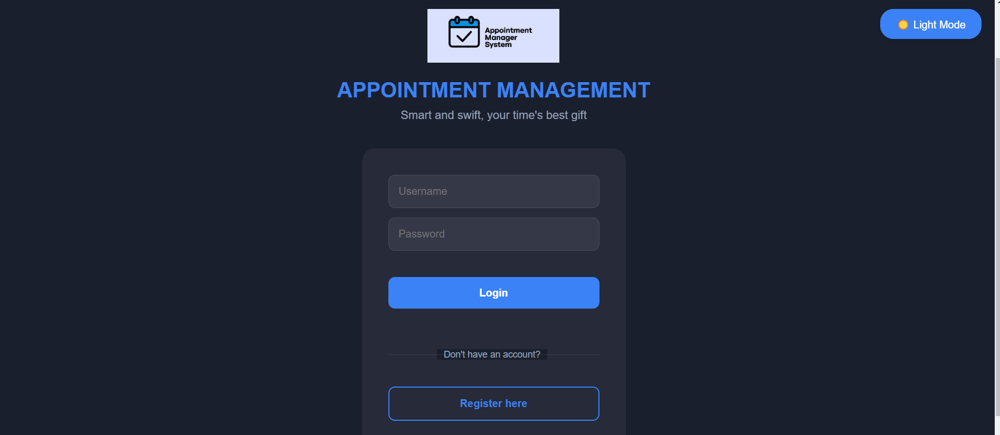
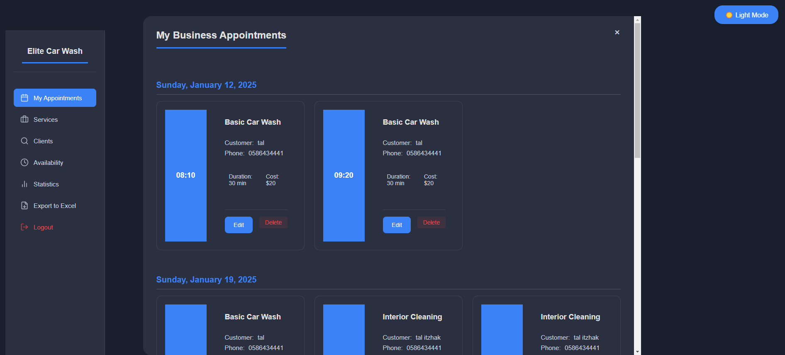
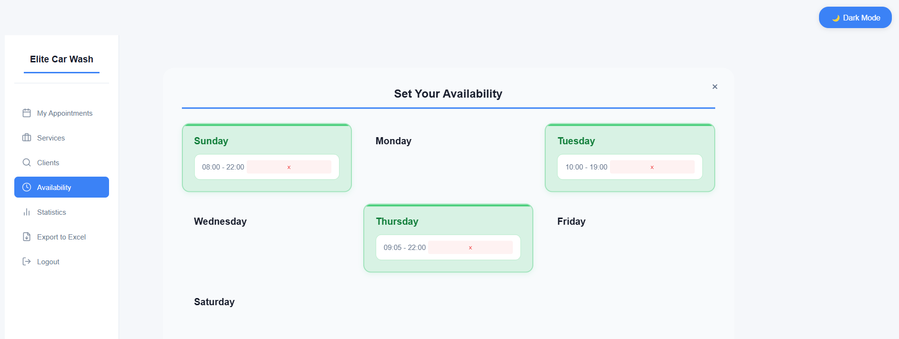

# 🗓️ Appointment Management System

A full-stack appointment scheduling application built with FastAPI and React, featuring a dark/light theme and role-based access control.

### 🖼️ Screenshots

## Login and Registration


## Business Management




## Customer Features


## ✨ Features

### For Business Owners
- 📅 Manage service availability by day and time
- 💼 Create and manage services with pricing
- 📊 View daily statistics and revenue
- 📋 Export appointments to Excel
- 🔍 Search client appointments by phone number

### For Customers
- 👥 Browse available businesses
- 📅 Book appointments
- ⏰ View business availability
- 📋 Track appointment history

### General Features
- 🌓 Dark/Light theme toggle
- 🔐 JWT authentication
- 👥 Role-based access control
- 📱 Responsive design
- ⚡ Real-time validation

## 🚀 Getting Started

### Docker Setup (Recommended)
1. Create a `docker-compose.yml` file in the root directory:
   ```yaml
   version: '3.8'
   
   services:
     backend:
       build: ./backend
       ports:
         - "8000:8000"
       volumes:
         - ./backend:/app
       command: uvicorn app.main:app --host 0.0.0.0 --port 8000 --reload
   
     frontend:
       build: ./frontend
       ports:
         - "3000:3000"
       volumes:
         - ./frontend:/app
         - /app/node_modules
       environment:
         - REACT_APP_API_URL=http://localhost:8000
       depends_on:
         - backend
   ```

2. Run the application:
   ```bash
   docker-compose up --build
   ```

3. Access the application:
   - Frontend: `http://localhost:3000`
   - Backend API: `http://localhost:8000`
   - API Documentation: `http://localhost:8000/docs`

### Manual Setup

### Prerequisites
- Docker and Docker Compose
  OR
- Python 3.9+
- Node.js 16+
- SQLite (included)


```

## 🏗️ Architecture

### Backend
- **FastAPI**: Modern, fast web framework for building APIs with Python
- **SQLAlchemy**: SQL toolkit and ORM
- **Pydantic**: Data validation using Python type annotations
- **JWT**: Token-based authentication
- **SQLite**: Database (can be easily switched to PostgreSQL)

### Frontend
- **React**: UI library
- **Context API**: State management
- **CSS Modules**: Styling
- **Axios**: HTTP client
- **React Router**: Navigation

## 📁 Project Structure

```
## 📝 API Documentation

After running the backend server, visit:
- Swagger UI: `http://localhost:8000/docs`
- ReDoc: `http://localhost:8000/redoc`

## 🛠️ Testing

### Backend Tests
```bash
cd backend
pytest
```

### Frontend Tests
```bash
cd frontend
npm test
```

## 🌟 Contributing

1. Fork the repository
2. Create your feature branch (`git checkout -b feature/AmazingFeature`)
3. Commit your changes (`git commit -m 'Add some AmazingFeature'`)
4. Push to the branch (`git push origin feature/AmazingFeature`)
5. Open a Pull Request


## 👏 Acknowledgments

- FastAPI documentation
- React documentation
- SQLAlchemy documentation
